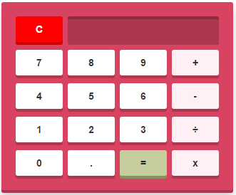

##Calculator Javascript
Tijdens deze opdracht ga je een rekenmachine programmeren in de web browser. Hierbij maak je gebruik van HTML, CSS en Javascript.

De opdracht bestaat uit twee type eisen, functionele eisen en technische eisen. Je moet aan alle deze eisen voldoen!

###Functionele eisen
Functionele eisen beschrijven welke functionaliteit je eindproduct moet bevatten. Functionele eisen mogen nooit van technische aard zijn! Ieder persoon moet begrijpen welke functionaliteit de opdracht moet bevatten, ongeacht kennisniveau.

De rekenmachine moet aan de volgende functionele eisen voldoen:
* De rekenmachine heeft knoppen voor de getallen 0 tot en met 9.
* De rekenmachine heeft een knop (.) om decimalen in te voeren.
* De rekenmachine heeft een knop (+) om op te tellen.
* De rekenmachine heeft een knop (-) om af te trekken.
* De rekenmachine heeft een knop (x) om te vermenigvuldigen.
* De rekenmachine heeft een knop (÷) om te delen.
* De rekenmachine heeft een knop (=) om de berekening uit te voeren.
* De rekenmachine heeft een knop (c) om alle invoer ongedaan te maken.
* De rekenmachine heeft een venster waarin het ingevoerde getal of de uitkomst van de berekening getoond wordt.

###Technische eisen
Technische eisen beschrijven aan welke vakgerichte voorwaarden de opdracht moet voldoen. Bijvoorbeeld dat de opdracht in correct validerend HTML en CSS moet zijn geschreven. 

De rekenmachine moet aan de volgende technische eisen voldoen:
* De presentatie van de rekenmachine is gemaakt door gebruik te maken van HTML en CSS.
* De logica van de rekenmachine is geprogrammeert in Javascript.
* Getallen worden ingevoerd door te drukken op de knoppen van de rekenmachine.
* De rekenmachine laat bij berekeningen met meer dan 2 cijfers de uitkomst van de tussenstappen zien. 
* De rekenmachine heeft ondersteuning voor het werken met hele getallen en getallen met decimalen.

###Bonus
* Los de afrondingsproblemen bij berekeningen met decimalen op. Voorbeeld van dit probleem is de berekening 0.1 + 0.2 , volgens Javascript is de uitkomst 0.30000000000000004.
